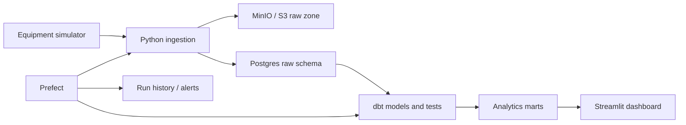

# Industrial Data Telemetry Pipeline

A portfolio-grade ETL/ELT system that simulates factory sensor data, preserves
raw batches in S3-compatible storage, models trustworthy analytics with dbt,
orchestrates the workflow with Prefect, and surfaces operator decisions in a
Streamlit dashboard.

## What this demonstrates

- Idempotent ingestion with retries and additive schema-drift logging
- Raw → staging → intermediate → mart data modeling
- Data-quality gates and source freshness checks in dbt
- Observable orchestration with run history and webhook alerts
- A decision-focused dashboard for anomaly, degradation, and SLO monitoring
- Local reproducibility with Docker and secure AWS infrastructure with Terraform

Read [architecture.md](architecture.md) for the system design and tradeoffs.

## Product management portfolio

- [Product implementation plan](docs/PRODUCT_IMPLEMENTATION_PLAN.md) — phased
  requirements checklist, acceptance criteria, and evidence needed before each
  feature is marked complete
- [Product requirements document](docs/PRD.md) — users, requirements,
  acceptance criteria, success metrics, rollout, risks, and open questions
- [PM portfolio case study](docs/PM_PORTFOLIO_CASE_STUDY.md) — problem framing,
  prioritization, tradeoffs, learning agenda, and interview narrative
- [Product decisions and learning log](docs/PRODUCT_DECISIONS.md) — decisions,
  assumptions, validation status, and roadmap
- [Delivery status](docs/DELIVERY_STATUS.md) — original seven-session plan
  mapped to completed code and pending evidence

## Architecture



## Quick start

Prerequisites: Python 3.9+, Docker Desktop, and Make.

```bash
cp .env.example .env
make install
make infra-up
make flow
make dashboard
```

Open:

- Dashboard: <http://localhost:8501>
- MinIO console: <http://localhost:9001> (`minio` / `minio123`)
- Postgres: `localhost:5432` (`telemetry` / `telemetry_dev`)

`make flow` generates 500 events, stores one immutable NDJSON batch, inserts new
events into Postgres, runs every dbt model, executes all tests, and records the
run result. Repeating seed `42` demonstrates idempotency: the raw batch is
preserved but duplicate warehouse events are not inserted.

## Learn the pipeline one layer at a time

### 1. Generate and ingest

```bash
make ingest
```

Start with `src/telemetry_pipeline/generator.py`. Machines M-003 and M-009
gradually degrade and occasional spikes create actionable anomalies. Then read
`storage.py`: raw data is append-only while the warehouse uses `event_id` to
deduplicate retries.

### 2. Build and test transformations

```bash
make dbt
```

The dbt DAG is:

```text
raw.telemetry_events
  └─ stg_telemetry_events
      └─ int_machine_signals
          ├─ mart_machine_health
          ├─ mart_anomaly_events
          └─ mart_line_reliability
```

Run `cd dbt_project && ../.venv/bin/dbt docs generate` to produce dbt's lineage
catalog. Run `../.venv/bin/dbt docs serve` to browse it locally.

### 3. Run orchestration

```bash
make flow
```

`orchestration/flow.py` records `running`, `success`, or `failed` states in
`raw.pipeline_runs`. Ingestion retries transient failures. A non-empty
`ALERT_WEBHOOK_URL` receives a failure message.

To create the hourly Prefect deployment:

```bash
.venv/bin/prefect work-pool create local-process --type process
.venv/bin/prefect deploy --all
.venv/bin/prefect worker start --pool local-process
```

### 4. Explore the dashboard

```bash
make dashboard
```

The UI answers three questions: where should an operator intervene, which
machines are degrading, and which line misses the 98% healthy-event SLO.

### 5. Inspect cloud infrastructure safely

Install Terraform 1.6+, authenticate to a sandbox AWS account, then:

```bash
cd terraform
terraform init
terraform fmt -check
terraform validate
terraform plan
```

Review the plan and estimated costs before `terraform apply`. Apply is
intentionally not part of automated setup because RDS is billable. Destroy
learning resources when finished with `terraform destroy`.

The cloud deployment is intentionally two-phase because container images must
exist before scheduled tasks or services can run:

1. Apply once with the defaults `enable_pipeline_schedule=false` and
   `deploy_dashboard=false` to create the network, private RDS database, raw S3
   bucket, ECR repositories, Fargate definitions, IAM roles, and logs.
2. Build `Dockerfile` and `Dockerfile.dashboard`, tag the images with the ECR
   repository outputs, and push them using your authenticated AWS CLI.
3. Run the pipeline task once so it creates the raw warehouse contracts and dbt
   marts, then apply with `-var="enable_pipeline_schedule=true"`.
4. Apply with `-var="deploy_dashboard=true"` to launch the dashboard and output
   its load-balancer URL.

For a real deployment, add an HTTPS listener, certificate, DNS name, and an
identity-aware authentication layer before using operational data. The demo
load balancer serves HTTP and is not production-ready.

## Useful commands

| Command | Purpose |
|---|---|
| `make install` | Create `.venv` and install runtime/test dependencies |
| `make infra-up` | Start healthy Postgres and MinIO containers |
| `make ingest` | Run ingestion only |
| `make dbt` | Build models and run dbt tests |
| `make flow` | Run the complete ETL flow |
| `make dashboard` | Start Streamlit |
| `make test` | Run unit tests |
| `make lint` | Run static checks |
| `make infra-down` | Stop local infrastructure without deleting volumes |

## Data-quality story

- Source and staging IDs are `not_null` and `unique`.
- Status values are constrained to `healthy`, `warning`, and `critical`.
- A custom singular test rejects physically impossible sensor values.
- Reliability percentages must remain between zero and 100.
- Source freshness warns after 30 minutes and errors after two hours.
- A dbt failure makes the Prefect flow fail and can trigger an alert.

## Production evolution

With more time, add an incremental dbt strategy for larger volumes, a schema
registry for breaking changes, IAM roles instead of static S3 keys, a private
ECS Prefect worker, OpenTelemetry metrics, and a CI environment that integration
tests the full Docker stack.

## Repository map

```text
src/telemetry_pipeline/  simulator and ingestion
dbt_project/             SQL models, tests, and profile
orchestration/           Prefect end-to-end flow
dashboard/               Streamlit application
terraform/               AWS S3 and RDS infrastructure
sql/                     local warehouse bootstrap
tests/                   fast unit tests
```

## Connect anomaly events to the NCR workflow

Set `WORKFLOW_URL=http://127.0.0.1:8000` and `WORKFLOW_TOKEN` to Project 3's producer token.
After a successful mart build, the flow stages anomaly events in `raw.workflow_outbox` and
publishes them to `/anomaly-events`. Pipeline/dbt/freshness failures also stage an event.
Failed deliveries remain in the outbox; rerun `python -m telemetry_pipeline.workflow_events`
(or schedule it) to retry and catch up, 1000 mart rows/100 deliveries per pass. Repeated
publication is safe because Project 3 deduplicates by event ID. Run the publisher periodically
in addition to the flow; an application process is not a durable scheduler.

The source schema is the repo's actual `analytics.mart_anomaly_events`; raw event outbox
storage stays in `raw`. Outbox creation needs DDL permission on the local warehouse.
A process crash between mart completion and staging is recovered by the next publisher
pass while mart rows remain available. Historical rows removed before catch-up cannot be
recovered from the mart; archive-backed replay remains a next step. Standalone stale-data
scheduling is not implemented. Failure events use generic descriptions to avoid exporting
credentials from exception messages.

Shared architecture and pending integration work:
https://github.com/gokulg846/agentic-event-systems/blob/main/docs/system-architecture.md
No tests or paid services were run for this alignment change.
