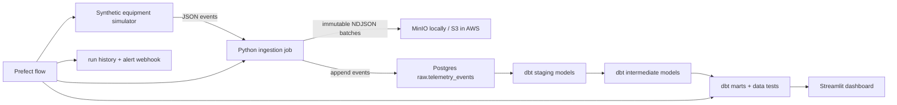

# Data Telemetry Pipeline Architecture

## Goal

Turn industrial equipment telemetry into three operator-facing insights:

1. **Anomaly triage** — which machines currently exceed safe temperature,
   vibration, or pressure thresholds?
2. **Degradation** — which machines show a worsening vibration trend relative to
   their recent baseline?
3. **Line reliability** — which production lines fall below the 98% healthy-event
   service-level objective?

The project is intentionally local-first. MinIO and Postgres make the complete
pipeline inexpensive to run on a laptop; S3 and RDS are the production-shaped
cloud equivalents defined in Terraform.

## Data flow

## Technology decisions

| Concern | Choice | Why |
|---|---|---|
| Source | Deterministic Python simulator | Reproducible demos, controlled anomalies, no fragile external API |
| Raw storage | S3-compatible NDJSON | Immutable replayable source; MinIO and AWS S3 use the same client |
| Warehouse | PostgreSQL | Strong SQL, inexpensive local use, supported by dbt and managed as RDS |
| Transform | dbt | Versioned SQL lineage and built-in data-quality testing |
| Orchestration | Prefect | Python-native retries, observability, and easy local scheduling |
| Dashboard | Streamlit + Plotly | Fast delivery without hiding the warehouse queries |
| Infrastructure | Docker Compose + Terraform | Reproducible local environment and auditable AWS infrastructure |

## Event contract

Each event contains an `event_id`, UTC `event_ts`, machine and line identifiers,
four numeric sensor readings, an equipment `status`, and a `schema_version`.
The raw JSON payload is also retained in Postgres so additive schema changes do
not discard information. The ingestion layer logs previously unseen keys.

## Reliability and security

- Object keys are time-partitioned and batch-specific, so ingestion never
  overwrites raw history.
- `event_id` is the warehouse primary key, making retries idempotent.
- Network and object-store calls use bounded exponential retries.
- dbt tests stop the flow when key constraints or accepted values fail.
- Secrets come from environment variables and `.env` is excluded from Git.
- Terraform encrypts S3 and RDS, blocks public S3 access, and marks database
  credentials as sensitive.

## Local and cloud mapping

| Local | AWS |
|---|---|
| MinIO bucket | S3 bucket |
| Docker Postgres | RDS PostgreSQL |
| Local Prefect process | ECS/Fargate or a small managed worker |
| Local Streamlit | Streamlit Community Cloud or container service |

The first deployment target is local. Cloud creation is deliberately a separate
operator action because `terraform apply` creates billable resources.
